% Micromouse
% Clara Casas Castedo & Miguel Sánchez de León Peque
% 2019-11-09

Introduction
============

OSHWDem :octopus:
-------

<video src="./videos/bulebule_camera_onboard.mp4" controls muted>
</video>


Micromouse
----------

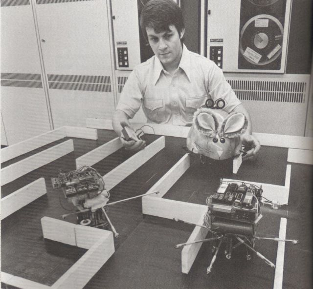


Electronics
===========

---


Infrarred sensors
-----------------

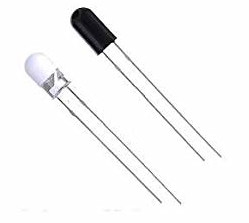{width=50%}

---

Mount
-----

{width=90%}


Simple schematic
----------------

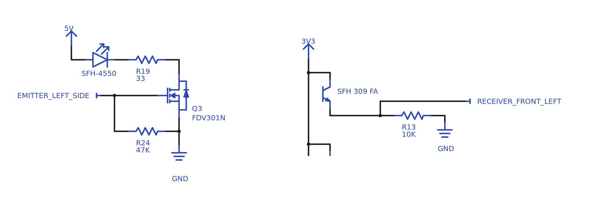

---

Complex schematic
-----------------

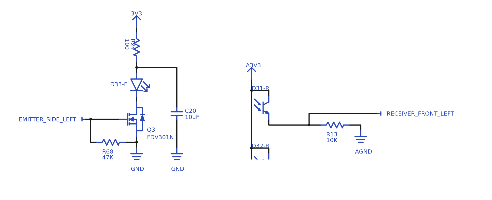

---

Distance calculation
--------------------

$$
y = e^{\frac{a}{x+b}}
$$

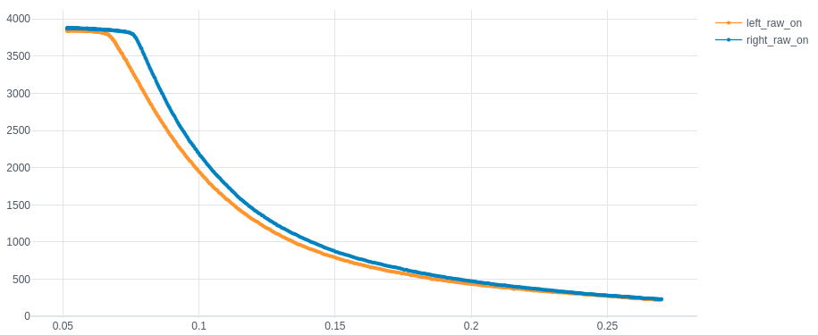

More on [micromouseonline.com](http://www.micromouseonline.com/2010/07/07/calibrating-reflective-sensors/)

---

Noise cancellation
------------------


---

Errors 
------

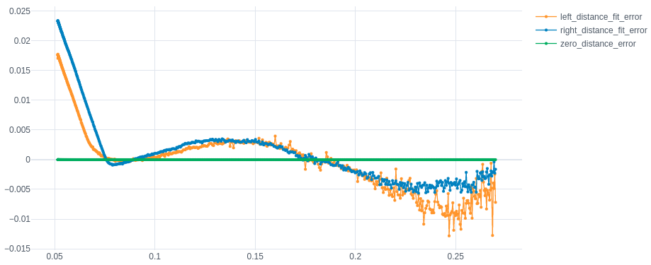


Linearity 
------

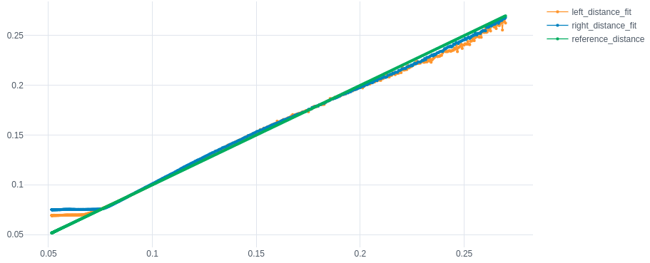


Motor Drivers
-------------

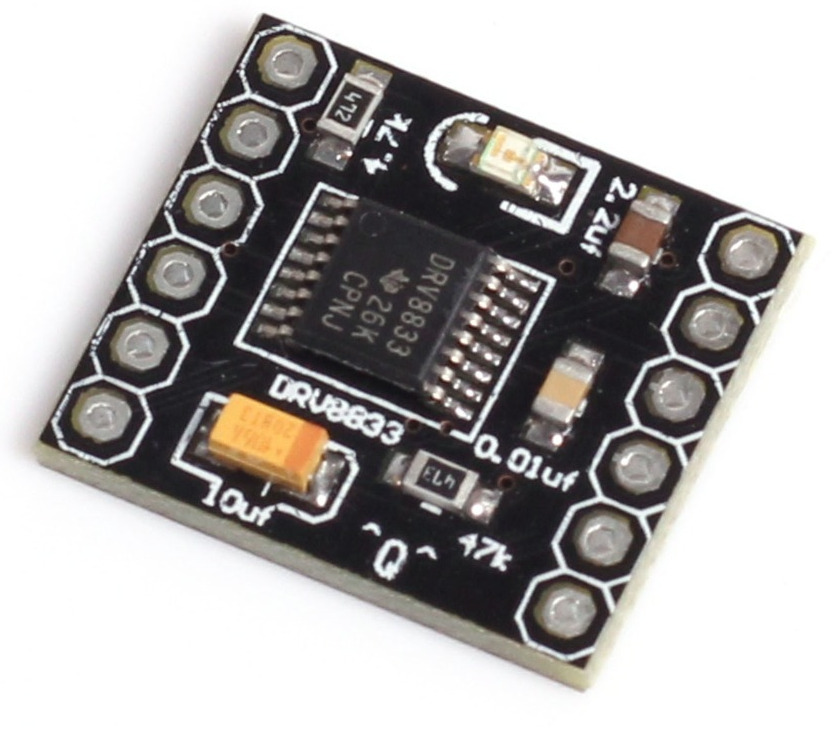{width=50%}


Encoders
--------

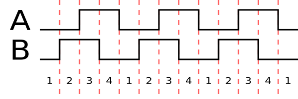{}

Gyroscope
---------

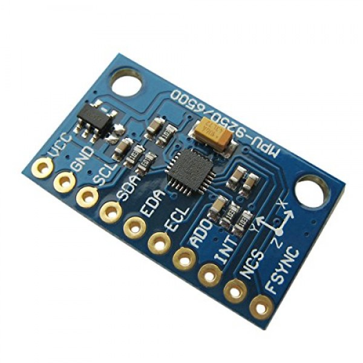{width=50%}


LEDs, speaker, buttons, switch
------------------------------


Bluetooth
---------

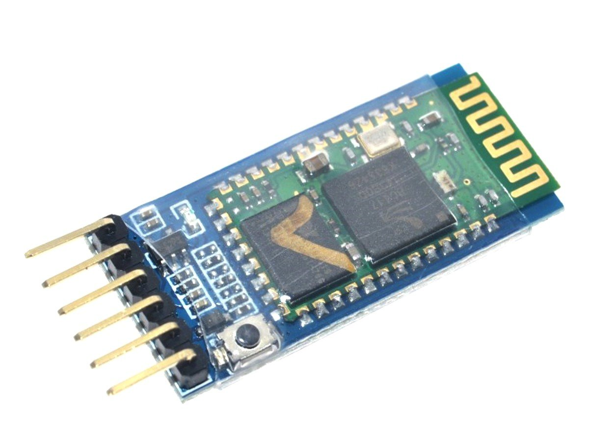{width=65%}

---

Battery and power coversors
---------------------------


---

Microcontroller
--------------

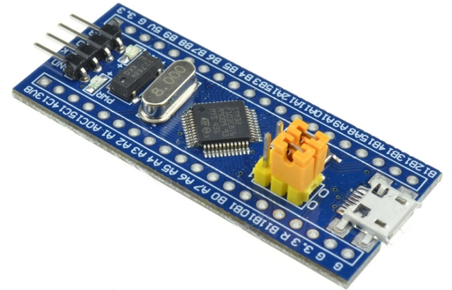{width=60%}

---

Peripheral | Use
--- | ---
ADC1 | Phototransistors
ADC2 | Battery
TIM1 | PWM signal for speaker / Sensors state machine
TIM2 | Left motor quadrature encoders
TIM3 | PWM signals for left and right motors
TIM4 | Right motor quadrature encoders
USART | Serial, Bluetooth
SPI | Gyroscope
GPIOS | Infrarred emitters, LEDs, buttons
SYSTICK | Control, encoder, distances

---

Prototyping
-----------

{width=90%}


Mechanical design :wrench:
=================

Wheels... but how many?
-----------------------

---

{width=80%}

Image taken from [micromouseusa.com](http://micromouseusa.com/wp-content/uploads/2014/03/futura-Cover.jpg)

---

{width=70%}

Image taken from [micromouseonline.com](http://www.micromouseonline.com/wp/wp-content/uploads/2017/10/Decimus5A.jpg)

---

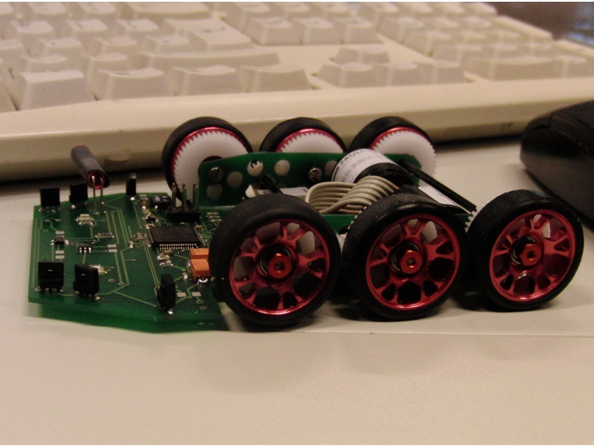{width=70%}

Image taken from [micromouseonline.com](http://www.micromouseonline.com/wp/wp-content/uploads/files/CIMG1994-full.jpg)

---


Image taken from [micromouseonline.com](http://www.micromouseonline.com/wp/wp-content/uploads/2015/11/IMG_5761.jpg)

Better start with 2...
----------------------

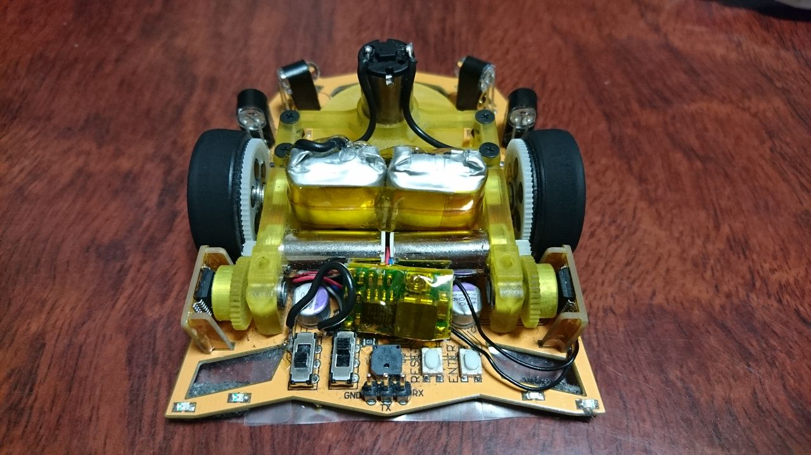{width=70%}

Image taken from [http://haido.blog.jp/](https://livedoor.blogimg.jp/haido2/imgs/3/b/3bce6ea8.jpg)

[CAD designs](https://bulebule.readthedocs.io/en/latest/building.html#rim)
-----------

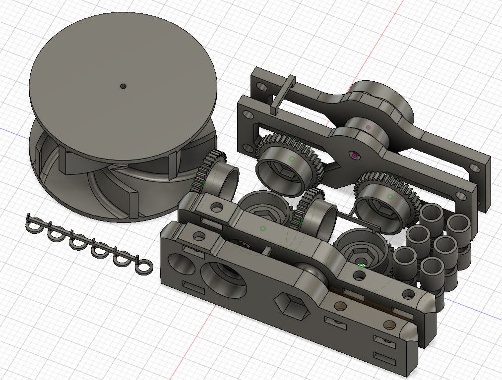{width=60%}

Image taken from [http://haido.blog.jp/](https://livedoor.blogimg.jp/haido2/imgs/4/1/418daa66.jpg)


And the fan?
------------

{width=50%}


Robot physics
=============

Goals :dart:
-----

>- Straight lines
>- Turns
>- :+1: :joy:

Limitations :sweat_smile:
-------------------------

- Acceleration

System
-------


Angular velocity
----------------

$$
\begin{aligned}
\overline{v_2} &= \overline{v_1} + \overline{w} \wedge \overline{r_{21}} \\
v_2 \overline{u} &= v_1 \overline{u} + (w \overline{u_z}) \wedge (2d \overline{t}) \\
v_2 &= v_1 + 2dw \\
\\
w &= \frac{v_2 - v_1}{2d}
\end{aligned}
$$

Linear velocity
---------------

$$
\begin{aligned}
\overline{v_M} &= \overline{v_1} + \overline{w} \wedge \overline{r_{M1}} \\
v_M \overline{u} &= v_1 \overline{u} + (w \overline{u_z}) \wedge (d \overline{t}) \\
v_M &= v_1 + wd \\
&= v_1 + \left(\frac{v_2 - v_1}{2d}\right)d \\
\\
v_M &= \frac{v_1 + v_2}{2}
\end{aligned}
$$

Control
=======

Approach
--------

>- Neural networks?
>- State space control?
>- ...

PID! :+1: :joy:
---------------

Feedback controller
-------------------

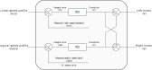{width=100%}


Trapezoidal speed profiles
==========================

Speed profile
-------------

{width=60%}

Calculating turns
-----------------

From the motion equations:

$$
\begin{aligned}
\dot{x} &= v_m cos \theta \\
\dot{y} &= v_m sin \theta
\end{aligned}
$$

Considering $\dot{w} \equiv cte.$ and $v_m \equiv cte.$:

$$
\theta = w_0 t + \frac{k}{d} t^2
$$

Discrete integration approximation
----------------------------------

{width=40%}


Sinusoidal speed profiles
=========================

Why not?
--------

$$
\omega = \omega_{max} sin\left(\frac{x}{\lambda}\right)
$$

$$
\dot{\omega} = \frac{\omega_{max}}{\lambda} cos\left(\frac{x}{\lambda}\right)
$$

Thanks [Peter](http://micromouseonline.com)! :smile:

Theoretical forces (straight)
------------------

$$
F_α = {mα \over 2}
$$

Theoretical forces (turn)
------------------

Angular acceleration

$$
F_{Δω} = {IΔω \over 2T}
$$

Centrifugal force

$$
F_ω = {mvω \over 2}
$$

Forces on each tire
-------------------

$$
F_R = \sqrt{(F_α + F_{Δω})^2 + F_ω^2} \\
F_L = \sqrt{(F_α - F_{Δω})^2 + F_ω^2}
$$

While turning $F_\alpha = 0$:

$$
F = \sqrt{\left({I\dot{\omega} \over 2T}\right)^2 + \left({mv\omega \over 2}\right)^2}
$$

So... :tada: :tada:
-----

$$
F = \sqrt{{I^2\omega_{max}^2 \over 4T^2\lambda^2} cos^2\left({x \over \lambda}\right) + {m^2 \omega_{max}^2 v^2 \over 4}  sin^2\left({x \over \lambda}\right)}
$$

$$
F = \sqrt{k_1 cos^2\left({x \over \lambda}\right) + k_2 sin^2\left({x \over \lambda}\right)}
$$

If $k_1 = k_2 = k_0^2$:

$$
F = k_0 \sqrt{cos^2\left({x \over \lambda}\right) + sin^2\left({x \over \lambda}\right)} = k_0
$$

Search turn trajectory
----------------------

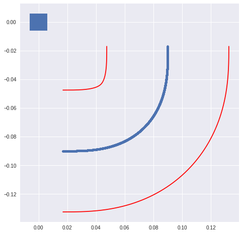

Search turn forces
------------------

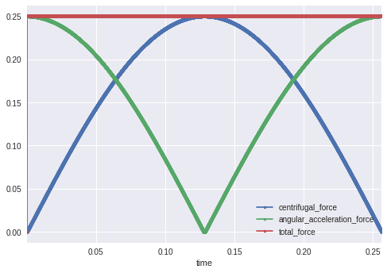

90° turn trajectory
-------------------

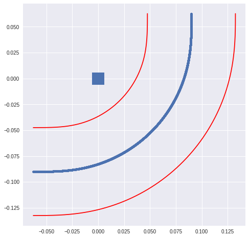

90° turn forces
---------------

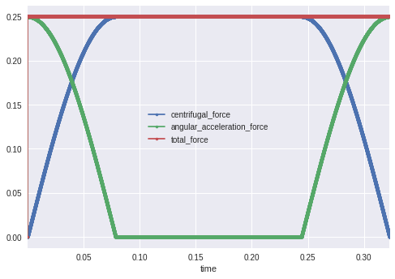

Other trajectories
------------------

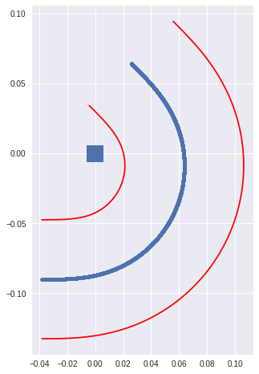

[Notebook on GitHub](https://github.com/Bulebots/bulebule/blob/master/scripts/notebooks/sinusoidal_turns.ipynb)

Advantages
----------

- Constant force
- Linear speed does not affect turn parameters!


Maze-solving algorithm
======================

Floodfill :ocean:
-----------------

1. Assume there are no walls
1. Calculate distances to target
1. While goal not reached...
1. Go to the cell that is closest to the target
1. Update walls
1. Update distances

---

<video src="./videos/maze-simulator.mp4" controls muted>
</video>

Update process :eyes:
--------------

```python
# Initialize distances
distances = inf
for goal in goal_cells:
  queue.push(goal)
  distances[goal] = 0

# Flood fill
while not queue.is_empty():
    cell = queue.pop()
    distance = distances[cell] + 1
    for direction in ["east", "south", "west", "north"]:
        if cell.has_wall(direction):
            continue
        if distances[cell.neighbor(direction)] <= distance:
            continue
        distances[cell] = distance
        queue.push(cell)
```

Software design
===============

Sensors state machine
---------------------

- 16 KHz trigger
- Sequentially power on and off 
- 4 states * 4 sensors

Systick
-------

- 1 KHz trigger
- Update ideal speed, encoder, distances
- Motor control 

Main
----

- Setup 
- Buttons, debug LEDs
- Speed profiles
- Algorithm
- Communication


Required tools
==============

Hardware
--------

- Battery charger
- Power supply
- Programmer
- Soldering station
- Polimeter
- Logic analyzer
- Oscilloscope

Software
--------

- **C language** - libopencm3, gcc, clang format
- **Python** - notebooks, scripts, communication
- **Continuous integration** - github, travis
- **Reviews & management** - github
- **Documentation** - doxygen, sphinx
- **Board design** - upverter

Maze
----


Logging
=======

---


Plotting 
--------

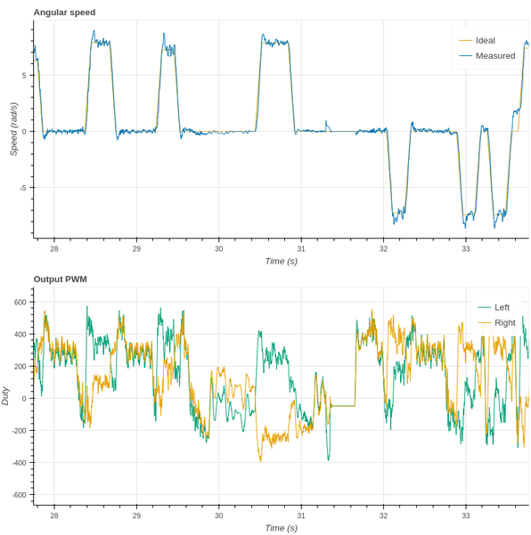{width=60%}


Costs
=====

Very optimistic costs
---------------------

- Around 60 €
- Half is just for motors+encoders (second hand)
- Electronic parts and boards are really cheap (carefully selected)

Realistic costs
---------------

- Lots
- Replacements
- Shipping costs
- More than 100 €
- Not counting tools, maze...

And then...
-----------

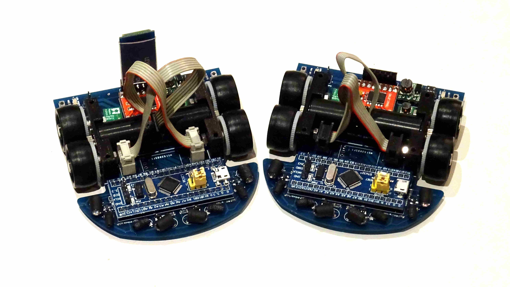

Time... :joy:
-------------

That's all! :tada:
==================

Resources :link:
-----

**Bulebots**

: - [github.com/Bulebots](https://github.com/Bulebots/bulebule)
: - [bulebule.readthedocs.io](https://bulebule.readthedocs.io)

**Peter Harrison**

: - [micromouseonline.com](http://micromouseonline.com)

**Green Ye**

: - [www.greenye.net](http://www.greenye.net/)
: - [micromouseusa.com](http://micromouseusa.com>)

Thanks! :heart:
--------------
