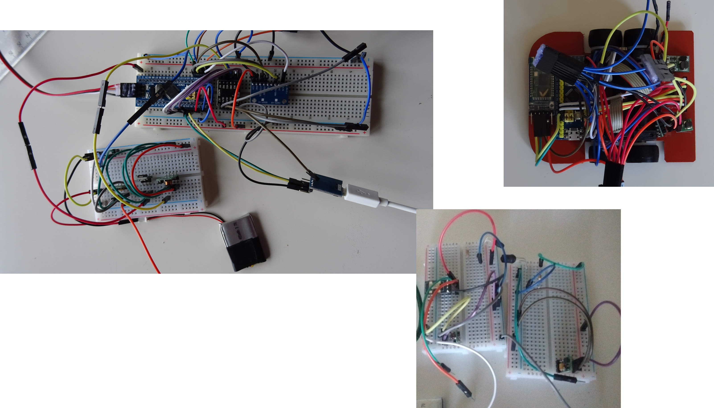
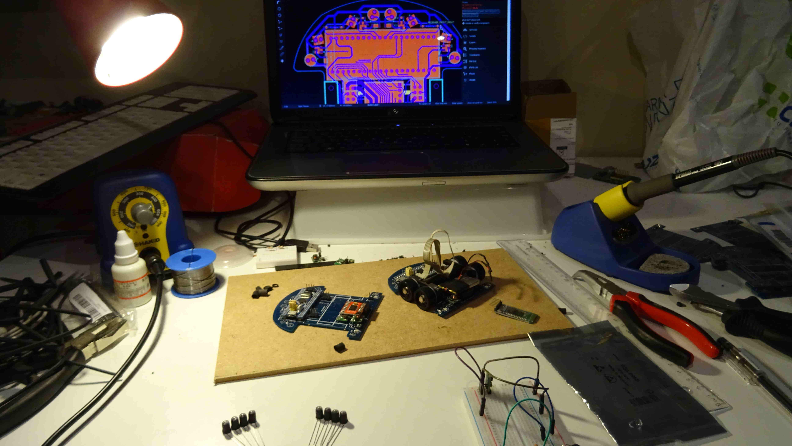
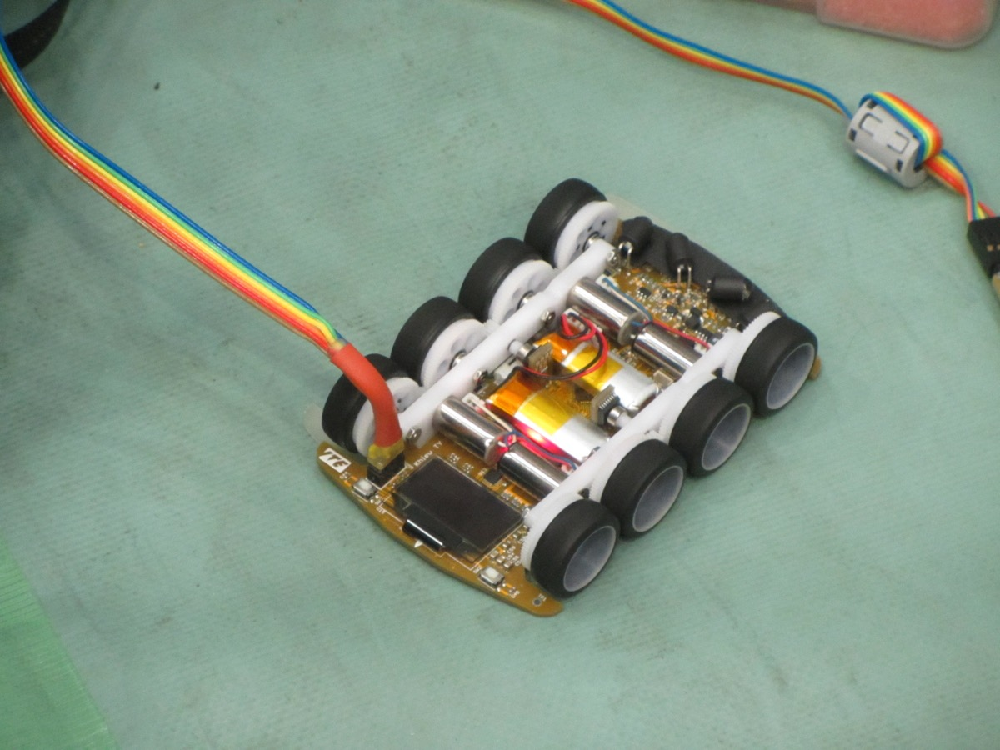
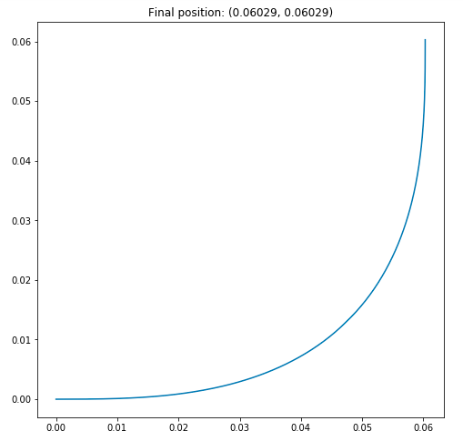
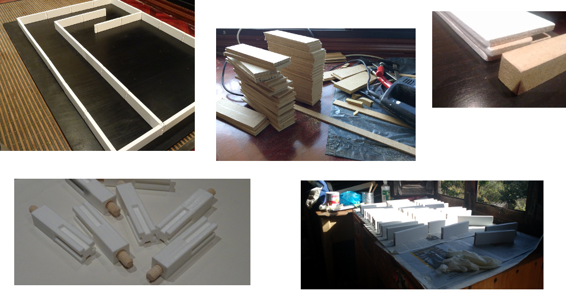
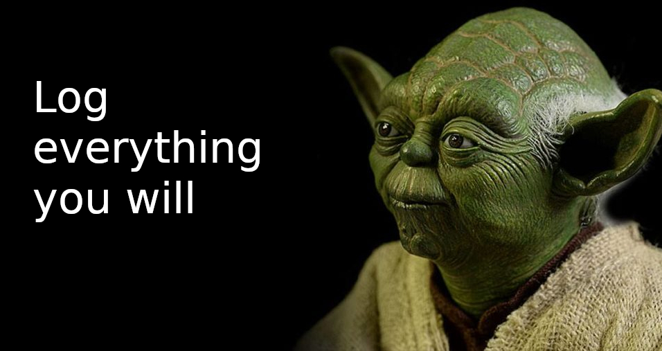
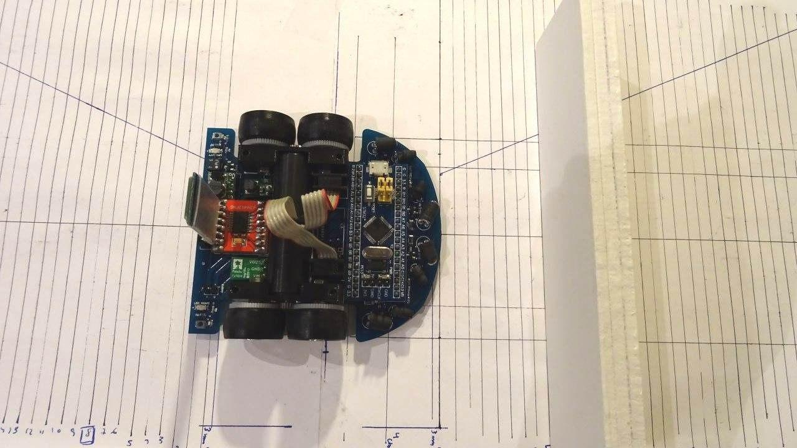
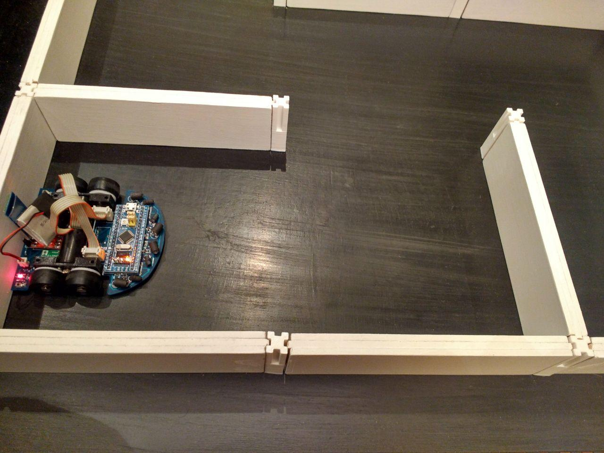
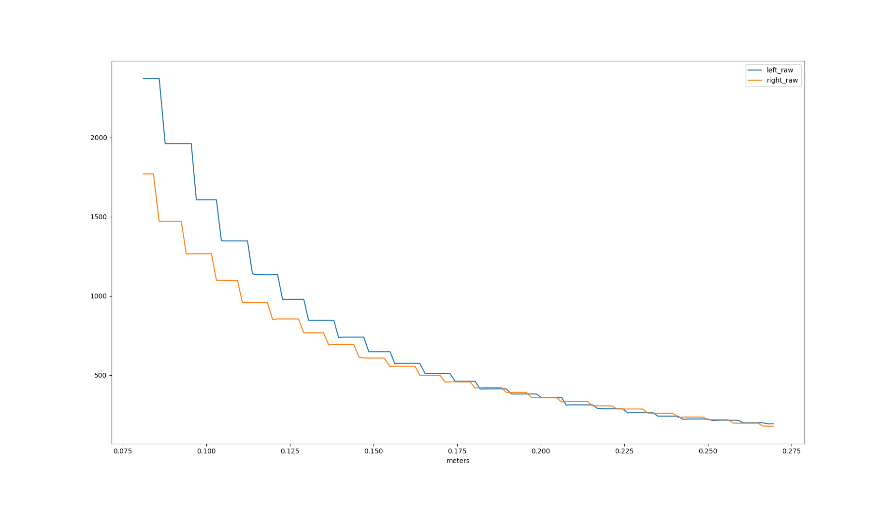

% Micromouse :microscope: :mouse:
% Clara Casas Castedo & Miguel Sánchez de León Peque
% 2019-11-09

Introduction
============

---

<video src="./videos/bulebule_camera_onboard.mp4" controls muted>
</video>


Micromouse
----------


Hardware
========

---

{width=50%}


Prototyping
-----------

{width=90%}


Schematic
---------

{width=100%}


---

<iframe title="Theseus" width="1000" height="650" scrolling="no" frameborder="0" name="Theseus" class="eda_tool" src="https://upverter.com/eda/embed/#tool=pcb,designId=3d82ffa66d538f81,actionId="></iframe>

Soldering
---------

{width=85%}

Robot physics
=============

Goals :dart:
-----

>- Straight lines
>- Turns
>- :+1: :joy:

Limitations :sweat_smile:
-------------------------

- Acceleration

System
-------


Angular velocity
----------------

$$
\begin{aligned}
\overline{v_2} &= \overline{v_1} + \overline{w} \wedge \overline{r_{21}} \\
v_2 \overline{u} &= v_1 \overline{u} + (w \overline{u_z}) \wedge (2d \overline{t}) \\
v_2 &= v_1 + 2dw \\
\\
w &= \frac{v_2 - v_1}{2d}
\end{aligned}
$$

Linear velocity
---------------

$$
\begin{aligned}
\overline{v_M} &= \overline{v_1} + \overline{w} \wedge \overline{r_{M1}} \\
v_M \overline{u} &= v_1 \overline{u} + (w \overline{u_z}) \wedge (d \overline{t}) \\
v_M &= v_1 + wd \\
&= v_1 + \left(\frac{v_2 - v_1}{2d}\right)d \\
\\
v_M &= \frac{v_1 + v_2}{2}
\end{aligned}
$$

Mechanical design :wrench:
=================

Wheels... but how many?
-----------------------

---

{width=80%}

Image taken from [micromouseusa.com](http://micromouseusa.com/wp-content/uploads/2014/03/futura-Cover.jpg)

---

{width=70%}

Image taken from [micromouseonline.com](http://www.micromouseonline.com/wp/wp-content/uploads/2017/10/Decimus5A.jpg)

---

{width=70%}

Image taken from [micromouseonline.com](http://www.micromouseonline.com/wp/wp-content/uploads/files/CIMG1994-full.jpg)

---

{width=70%}

Image taken from [micromouseonline.com](http://www.micromouseonline.com/wp/wp-content/uploads/2015/11/IMG_5761.jpg)

Better start with 2...
----------------------

[CAD designs](https://bulebule.readthedocs.io/en/latest/building.html#rim)
-----------


Control
=======

Approach
--------

>- Neural networks?
>- State space control?
>- ...

PID! :+1: :joy:
---------------

---

{width=90%}

Image taken from [micromouseusa.com](http://micromouseusa.com/) ([Futura Project](http://micromouseusa.com/?page_id=1342))

Speed profile
-------------

{width=60%}

Calculating turns
-----------------

From the motion equations:

$$
\begin{aligned}
\dot{x} &= v_m cos \theta \\
\dot{y} &= v_m sin \theta
\end{aligned}
$$

Considering $\dot{w} \equiv cte.$ and $v_m \equiv cte.$:

$$
\theta = w_0 t + \frac{k}{d} t^2
$$

Discrete integration approximation
----------------------------------

{width=40%}

[Notebook in GitHub](https://github.com/Theseus/bulebule/blob/master/scripts/notebooks/dynamic_turns.ipynb)

Maze-solving algorithm
======================

Floodfill :ocean:
-----------------

1. Assume there are no walls
1. Calculate distances to target
1. While goal not reached...
1. Go to the cell that is closest to the target
1. Update walls
1. Update distances

---

<video src="./videos/maze-simulator.mp4" controls muted>
</video>

Update process :eyes:
--------------

```python
# Initialize distances
distances = inf
for goal in goal_cells:
  queue.push(goal)
  distances[goal] = 0

# Flood fill
while not queue.is_empty():
    cell = queue.pop()
    distance = distances[cell] + 1
    for direction in ["east", "south", "west", "north"]:
        if cell.has_wall(direction):
            continue
        if distances[cell.neighbor(direction)] <= distance:
            continue
        distances[cell] = distance
        queue.push(cell)
```

Software design
===============

---

Peripheral | Use
--- | ---
ADC1 | Phototransistors
ADC2 | Battery
TIM1 | Sensors state machine
TIM2 | Left motor quadrature encoder
TIM3 | PWM signals for left and right motors
TIM4 | Right motor quadrature encoder
USART | Serial, Bluetooth
GPIOS | Infrarred emitters, LEDs, buttons
SYSTICK | Control

Sensors state machine
---------------------

- 16 KHz trigger
- Sequentially power on and off
- 4 states * 4 sensors

Systick
-------

- 1 KHz trigger
- Update ideal speed, encoder, distances
- Motor control

Main
----

- Setup
- Buttons, debug LEDs
- Side sensors calibration
- Algorithm
- Communication
- Collision detection


Required tools
==============

Hardware
--------

- Battery charger
- Power supply
- Programmer
- Soldering station
- Polimeter
- Logic analyzer
- Oscilloscope

Software
--------

- **C language** - libopencm3, gcc, clang format
- **Python** - notebooks, scripts, communication
- **Continuous integration** - github, travis
- **Reviews & management** - github
- **Documentation** - doxygen, sphinx
- **Board design** - upverter

Maze
----



Errors, debugging...
====================

---



Eye-opening experience
----------------------

{width=80%}

---

$$
y = e^{\frac{a}{x+b}}
$$


More on [micromouseonline.com](http://www.micromouseonline.com/2010/07/07/calibrating-reflective-sensors/)

---

{width=70%}

---



Costs
=====

Very optimistic costs
---------------------

- Around 60 €
- Half is just for motors+encoders (second hand)
- Electronic parts and boards are really cheap (carefully selected)

Realistic costs
---------------

- Lots
- Replacements
- Shipping costs
- More than 100 €
- Not counting tools, maze...

And then...
-----------


Time... :joy:
-------------

That's all! :tada:
==================

Resources :link:
-----

**Bulebots**

: - [github.com/Bulebots](https://github.com/Bulebots/bulebule)
: - [bulebule.readthedocs.io](https://bulebule.readthedocs.io)

**Peter Harrison**

: - [micromouseonline.com](http://micromouseonline.com)

**Green Ye**

: - [www.greenye.net](http://www.greenye.net/)
: - [micromouseusa.com](http://micromouseusa.com>)

Thanks! :heart:
--------------
